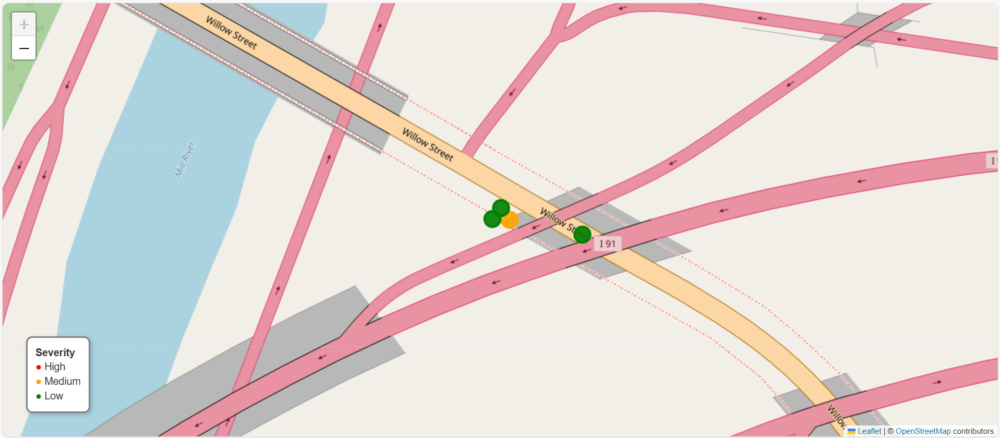

# UAV-Based Bridge Inspection Mapping Using Image Metadata

## 📸 Map Preview

This project demonstrates a workflow for mapping bridge inspection observations using UAV imagery and geospatial data.

GPS metadata was extracted directly from UAV images and used to generate geolocated inspection points. The data was then visualized using both a Python-based interactive map and ArcGIS Online to support spatial analysis and interpretation.

---

## 🌍 Live ArcGIS Map

[View Interactive Map](https://www.arcgis.com/home/item.html?id=69d0bcbb21ff484cb52153f5aeda03a5)

---

## 🧠 Project Workflow

1. UAV images collected from bridge inspection
2. GPS metadata extracted using Python (EXIF processing)
3. Inspection observations assigned to each image
4. Data visualized using:
   - Folium (Python interactive map)
   - ArcGIS Online (GIS-based visualization)

---

## 🛠️ Tools & Technologies

- Python (Google Colab)
- Folium (interactive mapping)
- Pillow (EXIF metadata extraction)
- ArcGIS Online (geospatial visualization)
- GitHub (project hosting)

---

## 📊 Output

- Interactive inspection map (`bridge_inspection_map.html`)
- GIS-based map hosted on ArcGIS Online
- Spatial representation of UAV-based inspection data

---

## 📌 Notes

- GPS coordinates are extracted directly from UAV image metadata

---

## 🚀 Future Extensions

- Integration with machine learning models for automated defect detection
- Scaling to larger infrastructure datasets
- Integration with asset management systems for decision support
